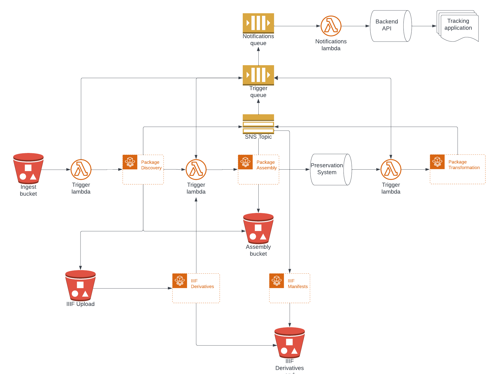

# digital_ingest_pipeline
Pipeline for ingesting digitized and born digital records into preservation systems, and delivering accessions, archival objects, and digital objects to ArchivesSpace.

## Usage

This repository contains AWS CloudFormation templates that create the infrastructure for a
pipeline designed to integrate with [Aurora](https://github.com/RockefellerArchiveCenter/aurora), 
[ArchivesSpace](https://archivesspace.org/), and [Archivematica](https://www.archivematica.org/en/).

## Architecture Diagram

## Related Repositories

- [digital_ingest_discovery](https://github.com/RockefellerArchiveCenter/digital_ingest_discovery/) - discovers 
and prepares packages for processing.
- [digital_ingest_assembly](https://github.com/RockefellerArchiveCenter/digital_ingest_assembly/) - creates Archivematica-compliant transfers.
- [digital_ingest_transformation](https://github.com/RockefellerArchiveCenter/digital_ingest_transformation/) - transforms 
and delivers accessions, archival objects and digital objects to ArchivesSpace.
- [digital_ingest_notifications](https://github.com/RockefellerArchiveCenter/digital_ingest_notifications/) - handles notifications for services associated with the ingest of digital content.
- [digital_ingest_trigger](https://github.com/RockefellerArchiveCenter/digital_ingest_trigger/) - invokes 
AWS Elastic Container Service (ECS) tasks based on SQS and S3 messages.
- [digital_ingest_webhook](https://github.com/RockefellerArchiveCenter/digital_ingest_webhook/) - provides an endpoint 
for Archivematica post-store callbacks.
- [zodiac_backend](https://github.com/RockefellerArchiveCenter/zodiac_backend/) - backend API which serves as the source
of truth about packages in these services.
- [zodiac_frontend](https://github.com/RockefellerArchiveCenter/zodiac_frontend/) - user interface to support tracking
of packages within these services.

## License

This code is released under the [MIT License](LICENSE).
